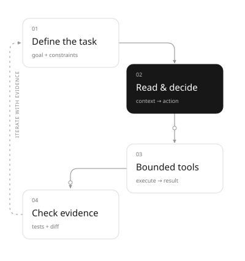

# learn-codex

**Use Codex well. Understand it, too.**

[中文](README.md) · [Quickstart](docs/en/quickstart.md) · [Course](docs/en/index.md) · [Acceptance record](docs/en/acceptance.md)

A practical course for students and developers with basic programming knowledge. Start with a real change, then move through **actual use → observable behavior → public source → minimal experiments**. The CLI is the main path, with a desktop workflow supplement. The Taskboard tag exercise, event output and independent acceptance checks connect everyday usage to implementation mechanisms.



## Run it first

Git and Python 3.10+ are required. The offline course and site use only the Python standard library; no Python package installation or key is needed. Run the following commands from the repository root.

```sh
git clone https://github.com/original4422/learn-codex.git
cd learn-codex
python3 scripts/course.py check
python3 scripts/course.py lab loop
python3 scripts/course.py serve --port 8765
```

Open the [site](http://127.0.0.1:8765) and select English at the top right. Chinese is the initial language. `check` runs behavior tests, a Skill black-box check, the bilingual build and local link validation. `serve` binds to loopback only; Ctrl-C stops it.

## A complete learning path

| Chapter | What you can do afterward |
| --- | --- |
| [01 First task](docs/en/01-first-task.md) | Install, authenticate and deliver a checkable tag feature |
| [02 Development loop](docs/en/02-workflow.md) | Define, read, implement, test, review and reflect |
| [03 Agent and tool loop](docs/en/03-agent-loop.md) | Explain decisions, calls, observations and termination using events |
| [04 AGENTS.md](docs/en/04-instructions.md) | Predict scope, discovery order and override behavior |
| [05 Skills](docs/en/05-skills.md) | Run and verify a project acceptance Skill |
| [06 Approval and isolation](docs/en/06-safety.md) | Separate permission, capability and successful execution |
| [07 Sessions and context](docs/en/07-context.md) | Resume work, retain facts and understand compaction limits |
| [08 MCP](docs/en/08-mcp.md) | Connect real stdio tools and verify rejection paths |
| [09 Subagents](docs/en/09-subagents.md) | Delegate independent tasks with boundaries and verify findings |
| [10 Automation](docs/en/10-automation.md) | Use exec events, structured output and App Server |
| [11 Desktop](docs/en/11-desktop.md) | Apply the same development loop in desktop workflows |

Also included: a [lab guide](docs/en/labs.md), [interactive playground](docs/en/playground.md), [source map](docs/en/source-map.md), [source/version record](docs/en/sources.md) and [contribution guide](docs/en/contributing.md), with equivalent Chinese and English coverage.

## A continuous case and real interfaces

[Taskboard](examples/taskboard/taskboard.py) is a runnable JSON command-line tool with legacy data compatibility, exact tag matching and atomic writes. Its [starter](examples/taskboard/starter.py) retains basic behavior so learners can implement a real change. The [acceptance program](examples/taskboard/acceptance.py) rejects that known-incomplete version and accepts the finished reference.

```sh
python3 examples/taskboard/acceptance.py
python3 scripts/course.py lab mcp-demo
python3 scripts/course.py lab probe
python3 scripts/course.py lab app-server
```

The first two commands do not need Codex. The latter two use the installed CLI without a model call. The real model path requires separate authentication:

```sh
CODEX_HOME="$PWD/.cache/codex-home" codex login
python3 scripts/course.py lab exec --allow-model
```

## Current capabilities and verification

| Path | Verified capability |
| --- | --- |
| Offline course | 65 behavior tests, 6 Taskboard acceptance checks and 39 Chinese/English site pages |
| Mechanism labs | Scripted tool loop, instruction discovery, policy, context and parallel aggregation |
| Real protocols | Python MCP stdio subprocess; Codex 0.155.1 CLI probe and App Server handshake |
| Real model | `exec --allow-model` is available; end-to-end model execution remains unverified |

Offline mechanism labs are teaching simplifications. Taskboard uses a single-writer JSON store. Real CLI evidence was collected on 2026-09-19; see the [2026-09-30 offline results](reports/taskboard-acceptance-2026-09-30.md) and [historical acceptance record](docs/en/acceptance.md).

## Version, scope and license

Checked on 2026-09-19. Source is pinned to `rust-v0.155.1` / `be2951ea34f0d295ed0becf97079f92fa5f6950e`; links, hashes and evidence are in [upstream.json](references/upstream.json). Live official documentation continues to change; chapters explain relevant boundaries.

This independent educational project licenses its original code, prose and diagrams under [MIT](LICENSE). Upstream [OpenAI Codex](https://github.com/openai/codex) is Apache-2.0. This repository links to its public implementation at a pinned version; downloaded source snapshots stay in the ignored local cache. Preview the website locally with the commands above.
