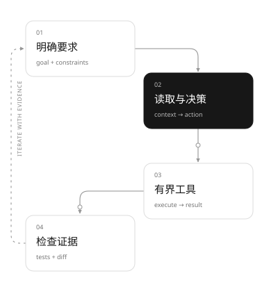

# learn-codex

**把 Codex 用好，也把它看懂。**

[English](README.en.md) · [快速开始](docs/zh/quickstart.md) · [课程目录](docs/zh/index.md) · [验收记录](docs/zh/acceptance.md)

面向有基本编程能力的学生与开发者，从一个真实的小改动出发，沿着「实际使用 → 可观察行为 → 公开源码 → 最小实验」学习 Codex。CLI 为主线，桌面端提供工作流补充。不是把另一套 Agent 教程换个名字，也不把 Python 教学模型称作 Codex 内核。



## 先跑起来

需要 Python 3.10+。离线课程与网站无第三方运行依赖，无需 Key。

```sh
python3 scripts/course.py check
python3 scripts/course.py lab loop
python3 scripts/course.py serve --port 8765
```

打开 [中文网站](http://127.0.0.1:8765)；右上角可切换英文。`check` 包含行为测试、Skill 黑盒检查、双语构建与本地链接校验。`serve` 只监听本机，Ctrl-C 停止。

## 一条完整的学习路线

| 章节 | 完成后能做什么 |
| --- | --- |
| [01 首次任务](docs/zh/01-first-task.md) | 安装、认证并交付一个可验收的标签功能 |
| [02 开发闭环](docs/zh/02-workflow.md) | 明确要求、读代码、实现、测试、审查与复盘 |
| [03 Agent 与工具循环](docs/zh/03-agent-loop.md) | 用事件解释决策、调用、观察与终止 |
| [04 AGENTS.md](docs/zh/04-instructions.md) | 预测作用域、发现顺序与覆盖行为 |
| [05 Skills](docs/zh/05-skills.md) | 运行并验证一个项目验收 Skill |
| [06 审批与隔离](docs/zh/06-safety.md) | 区分允许执行、能够执行与执行成功 |
| [07 会话与上下文](docs/zh/07-context.md) | 恢复任务、管理事实并理解压缩边界 |
| [08 MCP](docs/zh/08-mcp.md) | 接入真实 stdio 工具并验证拒绝路径 |
| [09 子 Agent](docs/zh/09-subagents.md) | 划分独立任务、提供边界与复查结果 |
| [10 自动化](docs/zh/10-automation.md) | 使用 exec 事件、结构化输出与 App Server |
| [11 桌面端](docs/zh/11-desktop.md) | 把同一开发闭环映射到桌面操作 |

另有[实验指南](docs/zh/labs.md)、[交互实验室](docs/zh/playground.md)、[源码地图](docs/zh/source-map.md)、[来源与版本](docs/zh/sources.md)和[贡献指南](docs/zh/contributing.md)，全部中英文对等。

## 贯穿案例与真实接口

[Taskboard](examples/taskboard/taskboard.py) 是实际可运行的 JSON 命令行工具，包含兼容旧数据、标签精确匹配和原子写入。交付的 [starter](examples/taskboard/starter.py) 保留基本功能，供读者真实实施变更；[验收器](examples/taskboard/acceptance.py) 会拒绝这个已知未完成版本，并接受完成版。

```sh
python3 examples/taskboard/acceptance.py
python3 scripts/course.py lab mcp-demo
python3 scripts/course.py lab probe
python3 scripts/course.py lab app-server
```

前两条不需要 Codex。后两条使用本机真实 CLI，但不调用模型。真实模型路径需要单独认证：

```sh
CODEX_HOME="$PWD/.cache/codex-home" codex login
python3 scripts/course.py lab exec --allow-model
```

本地模拟、真实协议、真实模型三种验证分别记录。交付环境的真实 CLI / App Server 已验证；模型请求未成功完成，不宣称真实模型任务通过，详情见[验收记录](docs/zh/acceptance.md)。

## 版本、范围与许可证

核实日期：2026-09-19。源码固定到 `rust-v0.155.1` / `be2951ea34f0d295ed0becf97079f92fa5f6950e`；链接、哈希与证据保存在 [upstream.json](references/upstream.json)。官方在线文档会持续变化，正文注明对应边界。

本项目为独立教学作品，原始代码、文案与图解采用 [MIT](LICENSE)。上游 Codex 为 Apache-2.0；保留源码链接与归属。当前 v1 仅交付本地仓库和预览，无远端仓库、公开部署或社媒发布。
